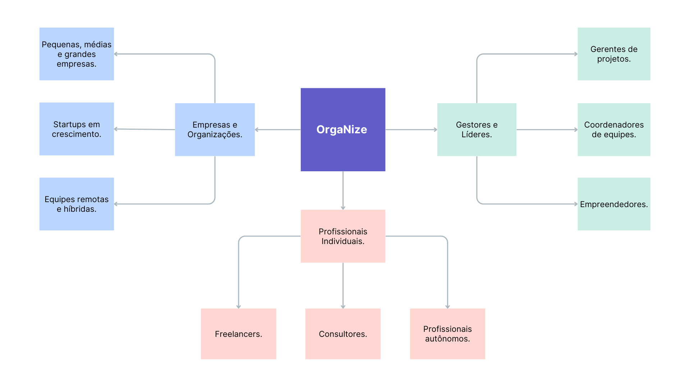

# Introdução

Em um ambiente corporativo, a organização e a gestão eficiente de tarefas são essenciais para o sucesso. Muitas empresas enfrentam desafios relacionados à desorganização e à má gestão de atividades, o que pode comprometer a produtividade e os resultados. Pensando nisso, o OrgaNize foi desenvolvido para oferecer uma solução eficiente, permitindo que equipes organizem, priorizem e acompanhem suas tarefas de forma estruturada, melhorando o fluxo de trabalho e a tomada de decisões.

## Problema

Entre as principais dificuldades estão:

A ausência de um sistema estruturado pode gerar diversos problemas nas equipes, como a **falta de priorização**, fazendo com que atividades secundárias sejam executadas enquanto tarefas críticas permanecem pendentes. Isso contribui para a **perda de prazos**, o que compromete tanto a reputação da empresa quanto a satisfação dos clientes. Além disso, a **sobrecarga de trabalho** se torna comum quando não há uma distribuição clara de tarefas, aumentando o risco de burnout entre os colaboradores. A **falta de visibilidade** também dificulta o acompanhamento do progresso dos projetos pelos gestores, comprometendo a tomada de decisões. Por fim, esses fatores juntos resultam em uma **redução da produtividade**, com tempo sendo desperdiçado em meio à desorganização e distrações.

<!-- > **Links Úteis**:
>
> - [Objetivos, Problema de pesquisa e Justificativa](https://medium.com/@versioparole/objetivos-problema-de-pesquisa-e-justificativa-c98c8233b9c3)
> - [Matriz Certezas, Suposições e Dúvidas](https://medium.com/educa%C3%A7%C3%A3o-fora-da-caixa/matriz-certezas-suposi%C3%A7%C3%B5es-e-d%C3%BAvidas-fa2263633655)
> - [Brainstorming](https://www.euax.com.br/2018/09/brainstorming/) -->

## Objetivos Específicos

O aplicativo OrgaNize propõe um sistema de "to-do" eficiente para mitigar esses problemas, organizando tarefas, melhorando a comunicação e garantindo um gerenciamento eficaz.

### Principais objetivo

A implementação de um sistema eficiente traz diversos benefícios para a gestão de atividades, começando pela **organização de tarefas**, que possibilita a criação, categorização e acompanhamento estruturado das demandas. Isso contribui diretamente para a **melhoria da comunicação**, ao facilitar a interação entre os usuários e garantir clareza nas responsabilidades. Com processos mais claros, há também um **aprimoramento da produtividade**, já que a sobrecarga é reduzida e o tempo dos usuários é melhor aproveitado. Além disso, o **gerenciamento** se torna mais eficaz, permitindo maior controle sobre o fluxo de trabalho, prazos e prioridades. Por fim, todos esses fatores colaboram para a **redução de problemas organizacionais**, minimizando falhas na execução e evitando retrabalho por meio de uma abordagem mais estruturada.

Esses objetivos garantem que o OrgaNize atenda às necessidades de seus usuários, promovendo eficiência e melhor gestão do tempo.

<!-- > **Links Úteis**:
>
> - [Objetivo geral e objetivo específico: como fazer e quais verbos utilizar](https://blog.mettzer.com/diferenca-entre-objetivo-geral-e-objetivo-especifico/) -->

## Justificativa

A gestão eficiente de tarefas e a comunicação clara são elementos essenciais para a produtividade em diversos contextos, sejam eles acadêmicos, profissionais ou pessoais. No entanto, a falta de organização pode resultar em atrasos, falhas na execução de atividades e dificuldades na priorização de demandas.

Diante desse cenário, o OrgaNize foi desenvolvido com o objetivo de otimizar a gestão de tarefas, proporcionando um sistema estruturado que facilita o acompanhamento de prazos, a definição de prioridades e a minimização de falhas organizacionais. A ferramenta visa aprimorar a comunicação entre os envolvidos e aumentar a produtividade, garantindo um gerenciamento mais eficiente e assertivo.

<!-- > **Links Úteis**:
>
> - [Como montar a justificativa](https://guiadamonografia.com.br/como-montar-justificativa-do-tcc/) -->

## Público-Alvo

O público-alvo abrange uma ampla gama de profissionais e organizações que buscam soluções para gestão, produtividade e colaboração. Eles podem ser classificados em três grandes grupos:

O público-alvo abrange **empresas e organizações** de diferentes portes, desde pequenas e médias empresas até grandes corporações e startups em expansão, incluindo também equipes que atuam de forma remota ou híbrida. Além disso, o sistema é ideal para **gestores e líderes**, como gerentes de projetos, coordenadores e empreendedores que precisam de ferramentas eficazes para otimizar processos e aumentar a eficiência de suas equipes. Por fim, também atende **profissionais individuais**, como freelancers, consultores e autônomos que buscam soluções práticas para melhorar sua organização, produtividade e gestão do tempo.

## Perfis dos Usuários

A aplicação será utilizada por diferentes perfis de usuários, cada um com características específicas em relação ao conhecimento prévio, relação com a tecnologia e estrutura hierárquica.

#### Usuário Experiente em Tecnologia

- Tem facilidade com plataformas digitais e sistemas de gestão.
- Costuma utilizar automação de processos e integração entre ferramentas.
- Possui autonomia para explorar novas funcionalidades.

#### Usuário Intermediário

- Tem conhecimento básico de ferramentas digitais, mas pode precisar de suporte inicial.
- Utiliza softwares de gestão de tarefas e produtividade regularmente.
- Pode necessitar de treinamentos ou documentação detalhada para uso avançado.

#### Usuário Iniciante ou Com Pouca Familiaridade com Tecnologia

- Prefere interfaces simples e intuitivas.
- Pode ter dificuldades em compreender recursos avançados.
- Precisa de um suporte mais estruturado, como tutoriais passo a passo.

#### Usuário em Posição de Liderança

- Encontra-se em níveis gerenciais ou de decisão.
- Busca relatórios, dashboards e insights estratégicos sobre produtividade e desempenho.
- Pode demandar personalizações específicas para a gestão de equipes.

#### Usuário Colaborador

- Participa ativamente na execução das atividades e tarefas.
- Precisa de ferramentas para organização do trabalho e comunicação eficiente com a equipe.
- Pode não estar envolvido diretamente na tomada de decisão.

## Mapa de Stakeholders:

A OrgaNize é uma solução voltada para diferentes perfis de stakeholders, abrangendo desde grandes organizações até profissionais autônomos. Entre os principais públicos atendidos estão as empresas e organizações, que incluem pequenas, médias e grandes empresas, startups em crescimento e equipes remotas ou híbridas que buscam mais eficiência e colaboração. Também são stakeholders os gestores e líderes, como gerentes de projetos, coordenadores de equipes e empreendedores, que necessitam de ferramentas para liderar com mais organização. Por fim, a plataforma também atende profissionais individuais, como freelancers, consultores e profissionais autônomos, oferecendo suporte para que gerenciem melhor suas atividades de forma independente.

<!-- > **Links Úteis**:
>
> - [Público-alvo](https://blog.hotmart.com/pt-br/publico-alvo/)
> - [Como definir o público alvo](https://exame.com/pme/5-dicas-essenciais-para-definir-o-publico-alvo-do-seu-negocio/)
> - [Público-alvo: o que é, tipos, como definir seu público e exemplos](https://klickpages.com.br/blog/publico-alvo-o-que-e/)
> - [Qual a diferença entre público-alvo e persona?](https://rockcontent.com/blog/diferenca-publico-alvo-e-persona/) -->
