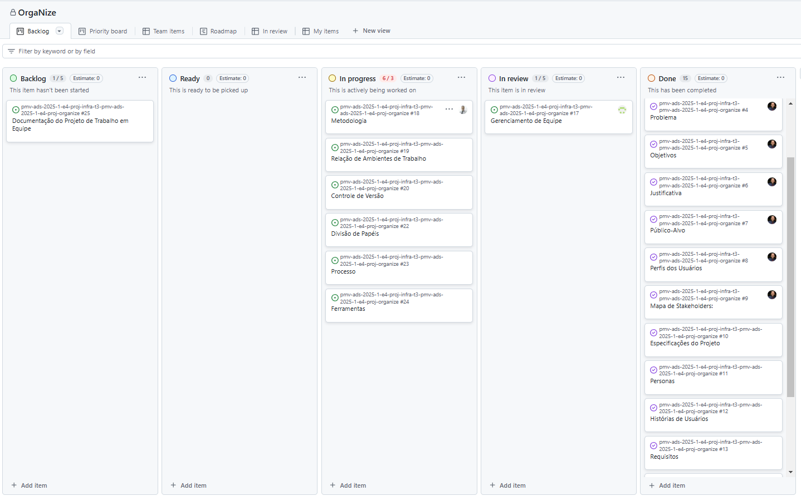

# Especificações do Projeto

Pré-requisitos: <a href="1-Documentação de Contexto.md"> Documentação de Contexto</a>

O projeto foi desenvolvido com foco em proporcionar uma gestão eficiente de tarefas para empresas, equipes e profissionais individuais. Suas especificações incluem uma interface intuitiva, recursos de organização de atividades, atribuição de responsabilidades, acompanhamento de prazos e geração de relatórios.

## Personas

#### João, 40 anos, Gerente de Projetos

- João tem 40 anos, é Gerente de Projetos e enfrenta dificuldades para acompanhar o progresso das tarefas de sua equipe. Para otimizar a gestão e garantir a entrega eficiente dos projetos, busca um painel centralizado que facilite o monitoramento de prazos e a comunicação entre os membros da equipe, permitindo maior controle e previsibilidade sobre as entregas.

#### Mariana, 30 anos, Analista de Marketing

- Mariana tem 30 anos, é Analista de Marketing e enfrenta problemas de comunicação e retrabalho em suas atividades diárias. Para aumentar sua produtividade, busca uma ferramenta intuitiva que ajude a organizar suas tarefas, melhorar a colaboração com a equipe e reduzir erros operacionais.

#### Lucas, 25 anos, Desenvolvedor

- Lucas tem 25 anos, é Desenvolvedor e frequentemente recebe tarefas com informações insuficientes, o que impacta sua eficiência. Para otimizar seu trabalho e contribuir para o crescimento da empresa, precisa de um sistema que facilite a atribuição e o detalhamento das demandas, garantindo mais clareza e agilidade na execução dos projetos.

## Histórias de Usuários

Com base na análise das personas forma identificadas as seguintes histórias de usuários:

| EU COMO... `PERSONA`          | QUERO/PRECISO ... `FUNCIONALIDADE`                                                                              | PARA ... `MOTIVO/VALOR`                                          |
| ----------------------------- | --------------------------------------------------------------------------------------------------------------- | ---------------------------------------------------------------- |
| Eu como Gerente de projetos   | Quero monitorar e avaliar o andamento das tarefas relacionadas aos meus projetos (RF-008, RF-010)               | Para tomar decisões assertivas para atingir a meta estabelecida. |
| Eu como Analista de marketing | Quero organizar minhas tarefas diárias, respeitando prioridades e prazos estabelecidos (RF-005, RF-006, RF-009) | Para maximizar minha eficiência.                                 |
| Eu como Desenvolvedor         | Quero ter fácil e claro acesso às minhas demandas diárias (RF-008, RF-009)                                      | Para gerar os artefatos que me foram atribuídos.                 |

## Requisitos

As tabelas que se seguem apresentam os requisitos funcionais e não funcionais que detalham o escopo do projeto.

### Requisitos Funcionais

| ID     | Descrição do Requisito                                                                     | Prioridade | Responsável |
| ------ | ------------------------------------------------------------------------------------------ | ---------- | ----------- |
| RF-001 | Permitir que os usuários criem uma conta na plataforma.                                    | ALTA       | Bernardo    |
| RF-002 | Permitir a autenticação dos usuários na plataforma via e-mail e senha.                     | ALTA       | Bernardo    |
| RF-003 | Permitir que os usuários façam logout na plataforma.                                       | ALTA       | Bernardo    |
| RF-004 | Permitir a redefinição de senha dos usuários na plataforma.                                | ALTA       | Guilherme   |
| RF-005 | Permitir a leitura, criação e edição de tarefas na plataforma.                             | ALTA       | Helbert     |
| RF-006 | Permitir que o sistema notifique sobre os prazos e atualizações das tarefas na plataforma. | MÉDIA      | Bianca      |
| RF-007 | Permitir a atribuição e delegação de tarefas entre usuários.                               | MÉDIA      | Helbert     |
| RF-008 | Permitir a visualização do painel de status das tarefas, exemplo: 5/10.                    | MÉDIA      | Bianca      |
| RF-009 | Permitir a classificação de tarefas por prioridade (alta, média ou baixa) e categoria.     | MÉDIA      | Jefferson   |
| RF-010 | Permitir a geração de relatórios dentro da plataforma.                                     | BAIXA      | Helbert     |
| RF-011 | Permitir a criacao de usuario "Admin".                                                     | BAIXA      | Jonatas     |
| RF-012 | Permitir login por OAuth2                                                                  | BAIXA      | Guilherme   |
| RF-013 | Permitir a leitura, edição e exclusão de dados pessoais ao usuário                         | ALTA       | Guilherme   |
| RF-014 | Permitir a leitura de tarefas com base no status ou prioridade                             | ALTA       | Jefferson   |
| RF-015 | Permitir a exclusão de tarefas                                                             | ALTA       | Jefferson   |
| RF-016 | Permitir a Criação, edição, leitura e exclusão de grupo de tarefas                         | ALTA       | Jonatas     |
| RF-017 | Permitir a adição e exclusão de membro(s) do grupo de tarefas                              | ALTA       | Jonatas     |

### Requisitos não Funcionais

| ID      | Descrição do Requisito                                                                                                                                 | Prioridade |
| ------- | ------------------------------------------------------------------------------------------------------------------------------------------------------ | ---------- |
| RNF-001 | Interface responsiva para acesso em dispositivos móveis.                                                                                               | ALTA       |
| RNF-002 | Alta disponibilidade para acesso ininterrupto ao sistema.                                                                                              | ALTA       |
| RNF-003 | Armazenação segura de dados e logs de atividade.                                                                                                       | ALTA       |
| RNF-004 | Cumprimento de padrões de segurança e LGPD.                                                                                                            | ALTA       |
| RNF-005 | A plataforma deve ser capaz de lidar com um aumento no número de usuários sem comprometer o desempenho.                                                | MÉDIA      |
| RNF-006 | A plataforma deve ser fácil de manter e atualizar, permitindo a adição de novos recursos e correções de bugs sem interrupção significativa no serviço. | MÉDIA      |
| RNF-007 | Tempo de resposta rápido para interações usuário-sistema (estimativa de 3 segundos)                                                                    | MÉDIA      |

## Restrições

O projeto está restrito pelos itens apresentados na tabela a seguir.

| ID  | Restrição                                                                    |
| --- | ---------------------------------------------------------------------------- |
| 01  | O projeto deverá ser entregue até o final do semestre.                       |
| 02  | Deverá ser um sistema distribuído.                                           |
| 03  | Deverá ser desenvolvido um módulo Front-end e um Back-end.                   |
| 04  | A equipe não pode subcontratar o desenvolvimento do trabalho.                |
| 05  | Todos os membros do grupo devem ser responsáveis por cada parte do Trabalho. |
| 06  | O sistema deverá ser desenvolvido para plataformas Web e Mobile.             |

## Diagrama de Casos de Uso

O diagrama de casos de uso é o próximo passo após a elicitação de requisitos, que utiliza um modelo gráfico e uma tabela com as descrições sucintas dos casos de uso e dos atores. Ele contempla a fronteira do sistema e o detalhamento dos requisitos funcionais com a indicação dos atores, casos de uso e seus relacionamentos.

# Gerenciamento de Projeto

De acordo com o PMBoK v6 as dez áreas que constituem os pilares para gerenciar projetos, e que caracterizam a multidisciplinaridade envolvida, são: Integração, Escopo, Cronograma (Tempo), Custos, Qualidade, Recursos, Comunicações, Riscos, Aquisições, Partes Interessadas. Para desenvolver projetos um profissional deve se preocupar em gerenciar todas essas dez áreas. Elas se complementam e se relacionam, de tal forma que não se deve apenas examinar uma área de forma estanque. É preciso considerar, por exemplo, que as áreas de Escopo, Cronograma e Custos estão muito relacionadas. Assim, se eu amplio o escopo de um projeto eu posso afetar seu cronograma e seus custos.

## Gerenciamento de Tempo

## Gerenciamento de Equipe

