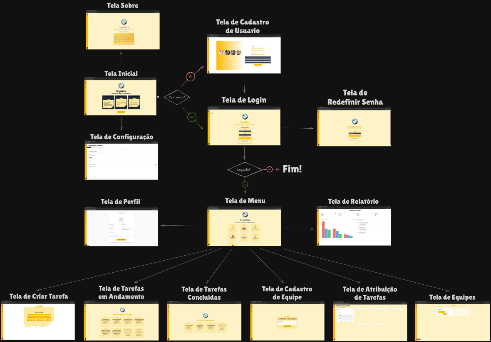
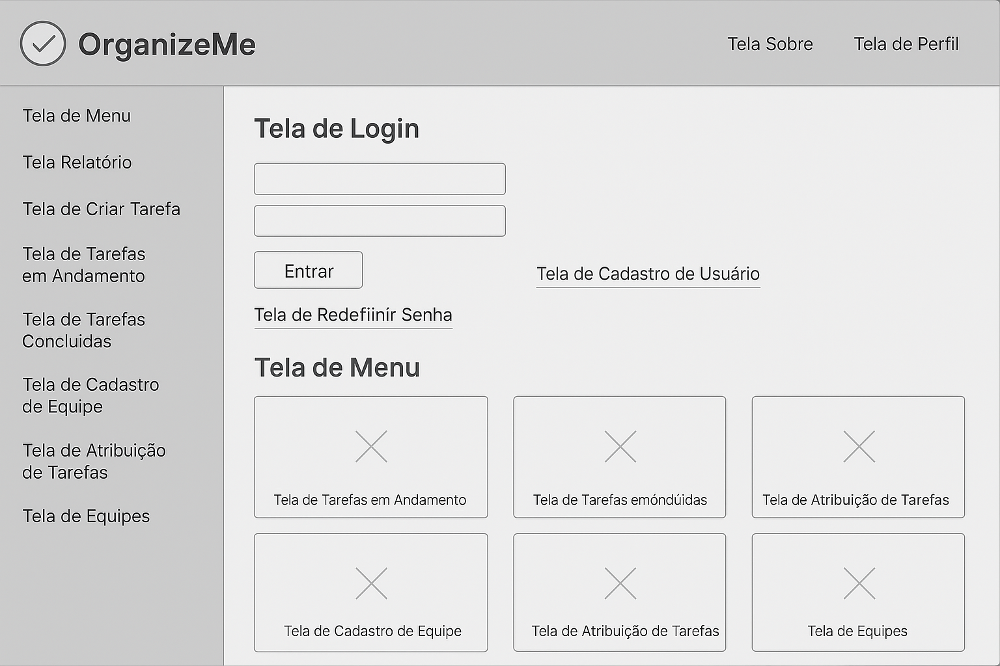

# Projeto de Interface

Pré-requisitos: <a href="2-Especificação do Projeto.md"> Documentação de Especificação</a>

Visão geral da interação do usuário pelas telas do sistema e protótipo interativo das telas com as funcionalidades que fazem parte do sistema (wireframes), tanto da versão web como para a versão mobile.

Apresente as principais interfaces da plataforma. Discuta como ela foi elaborada de forma a atender os requisitos funcionais, não funcionais e histórias de usuário abordados nas <a href="2-Especificação do Projeto.md"> Documentação de Especificação</a>.

## Diagrama de Fluxo

O diagrama de fluxo representa a navegação principal de um sistema de gerenciamento de tarefas chamado OrganizeMe. A estrutura inicia pela Tela Inicial, que leva à Tela de Login ou à Tela de Cadastro de Usuário, dependendo se o usuário já possui conta.

Após o login bem-sucedido, o usuário é direcionado à Tela de Menu, ponto central do sistema, de onde pode acessar diversas funcionalidades:

- Tela de Perfil
- Tela de Configuração
- Tela de Relatório
- Tela de Criar Tarefa
- Tela de Tarefas em Andamento
- Tela de Tarefas Concluídas
- Tela de Cadastro de Equipe
- Tela de Atribuição de Tarefas
- Tela de Equipes

Além disso, há caminhos auxiliares como a Tela de Redefinir Senha acessada pela Tela de Login e a Tela Sobre acessada pela Tela Inicial.

O fluxo termina se o login falhar ou se o usuário sair. O sistema é visualmente estruturado para guiar o usuário por um processo lógico desde a entrada até a gestão completa de tarefas e equipes.

## Wireframes

O wireframe apresenta uma interface inicial do sistema **Organize**, com foco em clareza e navegação eficiente. Ele utiliza um menu lateral à esquerda com acesso direto às principais seções. A área principal destaca uma visualização em cards da “Tela de Menu”, permitindo acesso rápido às funcionalidades centrais do sistema. O layout é limpo, em tons neutros, ideal para guiar o desenvolvimento de uma aplicação web responsiva e intuitiva.
