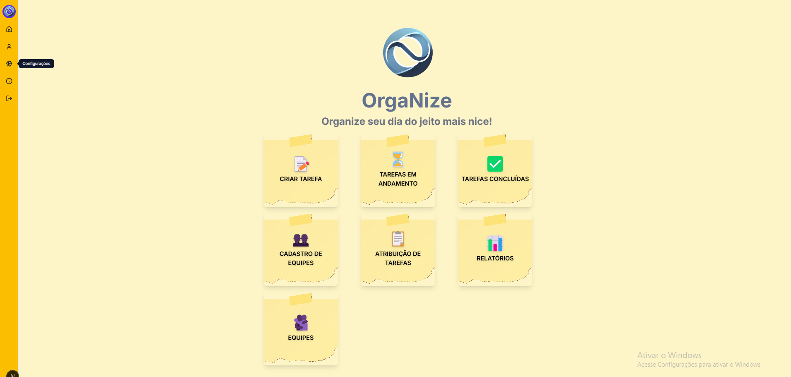
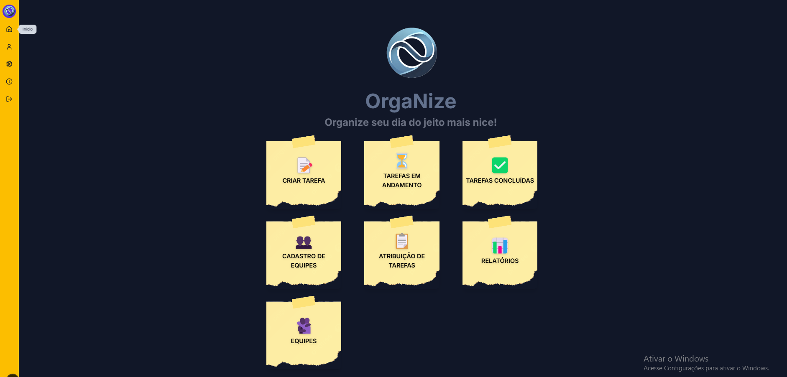
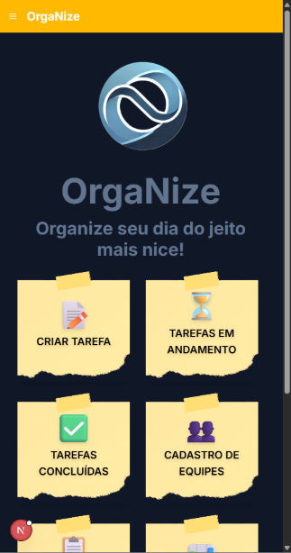

# Template Padrão da Aplicação

Pré-requisitos: <a href="2-Especificação do Projeto.md"> Especificação do Projeto</a>, <a href="3-Projeto de Interface.md"> Projeto de Interface</a>, <a href="4-Metodologia.md"> Metodologia</a>

Layout padrão das aplicações web e mobile que serão utilizado em todas as páginas com a definição de identidade visual, aspectos de responsividade e iconografia.

O layout padrão do site foi construído através dos padrões utilizados em projetos Next.js por meio da linguagem Javascript, padrões como Tailwind css para formatação de componentes, assim como códigos importados de bibliotecas como Material Ui, Shadcn Ui, etc.

## Identidade Visual

A identidade visual adotada para as aplicações web e mobile é moderna e equilibrada, combinando tons sóbrios como o *gray-900* e *slate-500* com cores vibrantes e acolhedoras como o amarelo (#ffbf00) e o âmbar claro (*amber-100*). Essa paleta transmite profissionalismo, acessibilidade e energia. A tipografia é limpa e legível, os ícones seguem uma linha minimalista e coerente, e o layout é responsivo, garantindo uma experiência fluida e consistente em diferentes dispositivos.

## Template Padrão

#### Tela de menu inicial (backgroundColor padrão)

Exibe interfaces responsáveis pela criação, gerenciamento e por fim finalização de tarefas.

#### Tela de menu inicial (backgroundColor escuro)

#### Tela de menu inicial (Responsivo backgroundColor padrão)

#### Tela de menu inicial (Responsivo backgroundColor escuro)

#### Tela de menu inicial Mobile (Responsivo backgroundColor claro)

