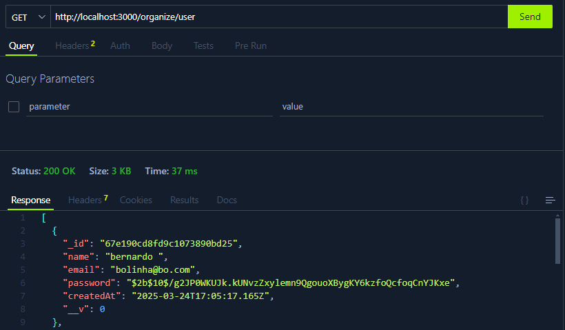
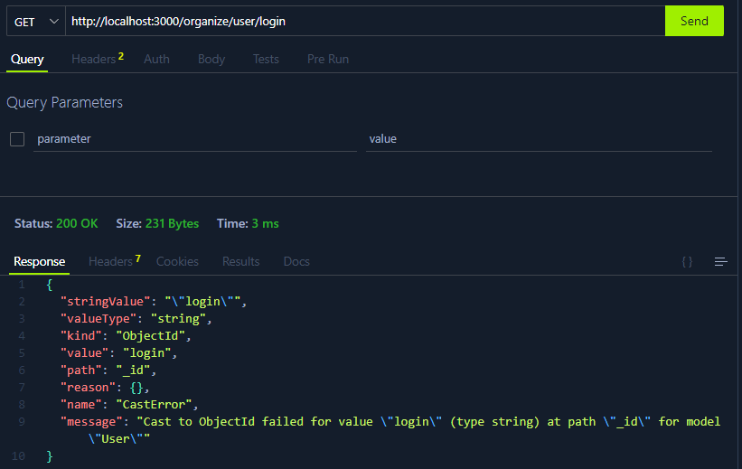

# Testes de Integração no Backend

## Teste de Integração - userController

Este conjunto de testes de integração tem como objetivo verificar se os principais métodos do userController funcionam corretamente ao interagir com o banco de dados e outros componentes do sistema, como autenticação e validação de dados.

### Método Create - Permitir que os usuários criem uma conta na plataforma

Aqui está a implementação da classe `userController` - Create:

```csharp
const userController = {
  create: async (req, res) => {
    try {
      const { name, email, password } = req.body;

      const userExists = await UserModel.findOne({ email });
      if (userExists) {
        return res.status(400).json({ msg: "Email já cadastrado!" });
      }

      const passwordStrengthRegex = /^(?=.*[A-Za-z])(?=.*\d)(?=.*[@$!%*?&])[A-Za-z\d@$!%*?&]{6,}$/;
      if (!passwordStrengthRegex.test(password)) {
        return res.status(400).json({
          msg: "A senha deve ter pelo menos 6 caracteres, 1 letra, 1 número e 1 caractere especial",
        });
      }

      const hashedPassword = await bcrypt.hash(password, 10);

      const newUser = new UserModel({
        name,
        email,
        password: hashedPassword,
      });

      const response = await newUser.save();

      res.status(201).json({ response, msg: "Usuário criado com sucesso!" });
    } catch (err) {
      console.log(err);
      res.status(500).json({ msg: "Erro interno do servidor." });
    }
  },
```

### Resultado:



---

### Método Login - Permitir a autenticação dos usuários na plataforma via e-mail e senha.

Aqui está a implementação da classe `userController` - Login:

```csharp
const userController = {
  login: async (req, res) => {
    try {
      const user = await UserModel.findOne({ email: req.body.email }).select(
        "+password"
      );

      if (!user) {
        return res.status(400).json({ error: "Dados Invalidos" });
      }

      const isPasswordValid = await bcrypt.compare(
        req.body.password,
        user.password
      );
      if (!isPasswordValid) {
        return res.status(401).json({ error: "Dados Invalidos" });
      }

      const token = jwt.sign({ userId: user._id }, process.env.JWT_SECRET, {
        expiresIn: "1h",
      });

      res.status(200).json({ message: "Login realizado com sucesso", token });
    } catch (err) {
      console.error(err);
      res.status(500).json({ error: "Erro interno no servidor" });
    }
  },
```

### Resultado



---

### Método Logout - Permitir que os usuários façam logout na plataforma.

Aqui está a implementação da classe `userController` - Logout:

```csharp
const userController = {
  logout: (req, res) => {
    const token = req.header("Authorization")?.split(" ")[1];

    if (!token) {
      return res.status(400).json({ error: "Token não fornecido." });
    }

    blacklist.add(token);

    res.json({ message: "Logout realizado com sucesso." });
  },
```

### Resultado


---
